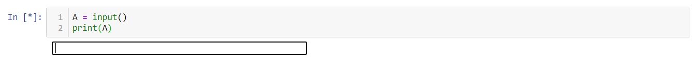
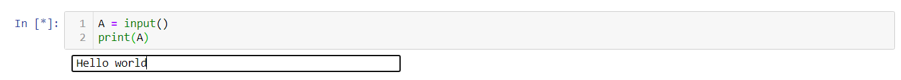

# Input and Output

As we have already encountered the *data types*, I think, it's clear to you that *Python* is one of the smartest programming languages. So a smart language has a very smart way to have **Input** and display its **Output**. 
Before going into this, we must know **What is Input and Output? Why we need these?**  

**Input** and **Output** (I/O) functionalities of a programming language are the most important tools to interact with human (The User). Actually, it is the process to run a program with the user given data and after completion, show its result. This function is called to tell the program to stop and wait for the user to input the values.

A lot of programming languages are there, which have complicated ways to get input and display the output, **Python** has the simplest way out here. In **Python** usually we use two *built-in* functions  `input()` and `print()` for standard I/O Operations. Let's check it.


 *(as we are talking about updated version of python so our discussion is confined to python 3 and upper versions; however only a few changes is need for python 2 , I think it's better to go for an updated version)*

## The Python inbuilt `input()` function


```python
A = input()
print(A)
```

    Hello world
    Hello world
    

We cannot show in this Jupyter notebook that how the Python interpreter/shell waits for the user to enter an input. But we have included the image below, how it looks *before* entering the input and *after* entering the input.


>How computer waits for the input of the user.


>How it looks after typing the input, but not pressing "Enter" yet.

In the previous example we have a input assigned to a variable `A` , and `print(A)` displays the assigned value of `A`. Here, two `"Hello world"` is printed because it is Jupyter notebook, and it is like a Python shell. It prints the 1st line, i.e., `A`, and then prints the value of `A` due to `print(A)`. But if you try out this in an editor, and execute your program, then you should see only one output, one and only due to `print(A)`.

Now if we want to convey a message with the `input()`, how to deal with? 


```python
S = input("Enter something : ") # see we've used ("") - the quotation mark with the input function to display the message
# Also the spaces used within the quotation marks appears at the output at same places
print(S)
```

    Enter something : FearlessPython
    FearlessPython
    


```python
D = input("enter a number: ")
print(D)
```

    enter a number: 29
    29
    

But hey, didn't we check the *data-types* ? Let's check it.


```python
type(A), type(S), type(D)
```


    (str, str, str)


What's wrong with the number `29`? We inputted an integer number to `D` but `type(D)` is showing the data-type as string (`str`). Actually you have to clarify which type of data you want as an **input**. Otherwise, by default it will treat it as a string. See the following examples for better understanding.


```python
a1 = int(input("Enter a integer number: ")) # It means only integer type data are to be assigned to a1.
```

    Enter a integer number: 9
    


```python
print(a1)
print(type(a1))
```

    9
    <class 'int'>
    

If we use a floating point number input to a pre-declared integer-input shall there be any error message? 
Of course, as the input have to be an integer as declared, we can't use any non-integer data type here. 


```python
e = int(input("Enter a integer number: "))
```

    Enter a integer number: 2.5
    


    ---------------------------------------------------------------------------

    ValueError                                Traceback (most recent call last)

    <ipython-input-7-f048d16813b2> in <module>
    ----> 1 e = int(input("Enter a integer number: "))
    

    ValueError: invalid literal for int() with base 10: '2.5'


```python
a2 = float(input("Enter a float number: ")) # For float input
print(a2)
```

    Enter a float number: 2.6
    2.6
    


```python
a3 = str(input("Enter a string : ")) # for string input, actually no need to declear it, as by default it python treates a  input() as string input . 
print(a3)
```

    Enter a string : Python is very easy!
    Python is very easy!
    

Programmers can even use more than one `input()` function in a single line. The simplest way is given below.


```python
name, age, wt = input("Name = "), int(input("Age = ")), float(input("Weight = "))
```

    Name = FearlessPython
    Age = 1
    Weight = 2.5
    


```python
print(name)
```

    FearlessPython
    


```python
print(age)
```

    1
    


```python
print(wt)
```

    2.5
    

We think it's all enough with the `input()` function, now moving onto the next topic **output**.

## The Python inbuilt `print()` function


```python
print("We are", "always", "with", "you", ".")
```

    We are always with you .
    

At the beginning of this notebook as we have already discussed about the **OUTPUT**, let's see few examples.


```python
print("Hey! how are you? ")
```

    Hey! how are you? 
    


```python
c=5; d=4
print("The value of", c, "+", d, "is", c+d) 
# here we print 5+4 = 9 carefully go through the quotation ("") marks and the (,)comma
```

    The value of 5 + 4 is 9
    

*Let us go in depth!!*


```python
print(" What is your name ? " )
print(" My name is FearlessPython . ")
```

     What is your name ? 
     My name is FearlessPython . 
    


```python
print(" What is your name ? " ,end = '')
print(" My name is FearlessPython . ")
```

     What is your name ?  My name is FearlessPython . 
    


```python
print(" What is your name ? " ,end = '~~~')
print(" My name is FearlessPython . ")
```

     What is your name ? ~~~ My name is FearlessPython . 
    


```python
print(" What is your name ? " , end = "\n")
print(" My name is FearlessPython . ")
```

     What is your name ? 
     My name is FearlessPython . 
    

See, in the previous example there was no `end` given in the `print()` function. But in further example we use it as `end = ''` . Actually, it is optional. If omitted, then, default is `"\n"` (i.e., next printing will be in a new line).


```python
print('Fearless', 'Python', sep = ' ')
```

    Fearless Python
    


```python
print('Fearless', 'Python', sep = '-')
```

    Fearless-Python
    


```python
print('Fearless', 'Python', sep = '***')
```

    Fearless***Python
    

 *syntax* : 
 ```Python
 print(var1, var2, ..., sep = 'str1', end = 'str2', file = object, flush = boolean)
 ```

The meaning of all these arguments inside the `print()` are given below . 

*  `var1, var2, ...`: *variables* or *string/integer/float/boolean* to be printed. If omitted then by default a line break/empty line will be printed.

*  `sep`: different elements are separated by a given string (`str1`). If omitted then default is white-space (`' '`).

*  `end`: a given string (`str2`) will be printed at the end. If omitted, default is (`"\n"`). 

*  `file`: an object with `write()` method. If omitted, then output will be written on standard oputput.

* `flush`: if `True`, the system is forcibly flushed. It is optional, if omitted, by default it is `False`.

Better option is you can go through `help(print)` in your Python shell. 

Now we will learn about **Printing With Style**.

### Python string formatting

Output values with any data type can be represented in more comprehensive way, so that the appearance of overall output is more self explanatory towards the user. This can be done by the proper formatting the output data. Formatting in python is performed in two ways - **`%` - specification** or by **`format()` function**.


```python
a = 3.1415926
print("The value of pi is %.6f" %a)   # here we use % - specificattion
print("The value of pi is {:.6f}".format(a))   # here we use format()

# Note that we are printing upto only 6 decimal place with rounding-off (using .6f)
```

    The value of pi is 3.141593
    The value of pi is 3.141593
    

Is there any problem ? Don't worry! It will be easy to you.

###### `%` must be used integrated with print statement . Let us denote `%y` as the specification, where, y can take the following values

*  **s** (for *string*), 
*  **d** or **i** (for *integer*),
*  **f** (for *floating point number*),
*  **o** (for *octal number*),
*  **x** (for *hexagonal number*),
*  **e** (for *exponential number*), 
*  **g** (for shorter version of `% f` and `% e`) and many more.


```python
number = 1729
print ("The Hardy-Ramanujan number: %d" % number)
```

    The Hardy-Ramanujan number: 1729
    

You can use more than one `%`-operator to format a given set of variables, enclosed in a *tuple*, following the operator. A very simple example is as follows:


```python
name = "Albert Einstein"
print("What is your name?")
print("This is %s." % name)
```

    What is your name?
    This is Albert Einstein.
    


```python
"%i is greater than %.3f" % (3, 2.999)
```


    '3 is greater than 2.999'


```python
e = 2.71828
print("The value of Euler's number is: %.2f" % e) 
# here .2 - before f signifies it will print the approximated value of 'e' upto 2 decimal places . 
```

    The value of Euler's number is: 2.72
    


```python
print("The approximated value is : %.5f" % 36.59592649 )
# Rounding-off to 5 decimal places
```

    The approximated value is : 36.59593
    


```python
name = "Isaac Newton"
print("Sir %-25s discovered gravity" % name )
# including white-space/padding after the placeholder (Isaac Newton)
```

    Sir Isaac Newton              discovered gravity
    


```python
name = "Albert Einstein"
print(" %25s is a great scientist." % name)
# including white-space/padding before the placeholder (Albert Einstein)
```

               Albert Einstein is a great scientist.
    

As the value of **%25s** reserves 25 characters,with extra spacing on the left side of the placeholder, and a value of **%-25s** puts any extra space to the right of the placeholder. See the previous examples.


```python
num = 56
print("The value of %d in octal number is %o " % (num, num))
print("The value of %d in hexagonal number is %x " % (num, num))
```

    The value of 56 in octal number is 70 
    The value of 56 in hexagonal number is 38 
    


```python
number = 2.789654123
print("%e " % number)
```

    2.789654e+00 
    


```python
year = 2020 ; virus = "Covid-19" ;
print("%i is the year of pandemic due to global %s." % (year, virus))
```

    2020 is the year of pandemic due to global Covid-19.
    

Another few important things are given follow :


```python
print("Hello\b World")    # Backspace, the attached character at left is removed.
```

    Hello World
    


```python
print("Hello\t World")    # Create a horizontal tab at it's place.
```

    Hello	 World
    

###### Now come to the easiest part  `format()` function.

*syntax*: 
```Python
print(".... {} .. {} .. {} ..." .format(var1, var2, var3 ....))
```

alternative ways are:

*syntax*: 
```Python
print(".... {0} .. {1} .. {2} ..." .format(var1, var2, var3 ....))
```

*syntax*: 
```Python
print(".... {ky1} .. {ky2} .. {ky3} ..." .format(ky1 = var1, ky2 = var2, .....))
```


```python
print("{0}{2} is very {1}.".format( "Fearless", "helpful", "Python"))
```

    FearlessPython is very helpful.
    


```python
print('Do you know the name of {}?' .format("Alan Turing"))
```

    Do you know the name of Alan Turing?
    

Previously I put an example actually it was of a **Truncating** (rounding off) decimal numbers example. 


```python
a = 3.1415926
print ("The value of pi is {:10.6f}".format(a)) # here I use format()
```

    The value of pi is   3.141593
    

We think you are familiar with the `split()` function. See here, it will be rounding-off the number upto 6 decimal places, and 10 before the (`.`) is for 10 spaces. But this (`:`) will not work in `%` - specification.

#### The Python f-string
From **Python 3.6** onwards, f-string is the most fantastic way to format strings. Their benefits are:
* More Readable
* Faster
* To the point
* Less chances of error

Few examples are enough to understand this method.

*(NOTE: This type of formatting won't work in versions prior to Python 3.6).*


```python
name = "Python"
birth = "1990"
inventor = "Guido van Rossum"

print(f"{name} was created by {inventor} in {birth}.")
```

    Python was created by Guido van Rossum in 1990.
    

Can something be more easier than this? You just have to include `f` before the string, so that Python understands that you are going to use the **f-string** type of formatting. You can also include `F` instead of `f`. But in most places, you are going to find `f`.

Let us see one more classic example.


```python
first_name = "James"
last_name = "Bond"

print("What is your name?")
print(F"The name is {last_name}, {first_name} {last_name}.")
```

    What is your name?
    The name is Bond, James Bond.
    

Its all enough for INPUT and OUTPUT. Moving on to the next topic . for further details over formating 
check  ```help('FORMATTING')``` .


```python
help('FORMATTING')
```

    Format String Syntax
    ********************
    
    The "str.format()" method and the "Formatter" class share the same
    syntax for format strings (although in the case of "Formatter",
    subclasses can define their own format string syntax).  The syntax is
    related to that of formatted string literals, but there are
    differences.
    
    Format strings contain “replacement fields” surrounded by curly braces
    "{}". Anything that is not contained in braces is considered literal
    text, which is copied unchanged to the output.  If you need to include
    a brace character in the literal text, it can be escaped by doubling:
    "{{" and "}}".
    
    The grammar for a replacement field is as follows:
    
          replacement_field ::= "{" [field_name] ["!" conversion] [":" format_spec] "}"
          field_name        ::= arg_name ("." attribute_name | "[" element_index "]")*
          arg_name          ::= [identifier | digit+]
          attribute_name    ::= identifier
          element_index     ::= digit+ | index_string
          index_string      ::= <any source character except "]"> +
          conversion        ::= "r" | "s" | "a"
          format_spec       ::= <described in the next section>
    
    In less formal terms, the replacement field can start with a
    *field_name* that specifies the object whose value is to be formatted
    and inserted into the output instead of the replacement field. The
    *field_name* is optionally followed by a  *conversion* field, which is
    preceded by an exclamation point "'!'", and a *format_spec*, which is
    preceded by a colon "':'".  These specify a non-default format for the
    replacement value.
    
    See also the Format Specification Mini-Language section.
    
    The *field_name* itself begins with an *arg_name* that is either a
    number or a keyword.  If it’s a number, it refers to a positional
    argument, and if it’s a keyword, it refers to a named keyword
    argument.  If the numerical arg_names in a format string are 0, 1, 2,
    … in sequence, they can all be omitted (not just some) and the numbers
    0, 1, 2, … will be automatically inserted in that order. Because
    *arg_name* is not quote-delimited, it is not possible to specify
    arbitrary dictionary keys (e.g., the strings "'10'" or "':-]'") within
    a format string. The *arg_name* can be followed by any number of index
    or attribute expressions. An expression of the form "'.name'" selects
    the named attribute using "getattr()", while an expression of the form
    "'[index]'" does an index lookup using "__getitem__()".
    
    Changed in version 3.1: The positional argument specifiers can be
    omitted for "str.format()", so "'{} {}'.format(a, b)" is equivalent to
    "'{0} {1}'.format(a, b)".
    
    Changed in version 3.4: The positional argument specifiers can be
    omitted for "Formatter".
    
    Some simple format string examples:
    
       "First, thou shalt count to {0}"  # References first positional argument
       "Bring me a {}"                   # Implicitly references the first positional argument
       "From {} to {}"                   # Same as "From {0} to {1}"
       "My quest is {name}"              # References keyword argument 'name'
       "Weight in tons {0.weight}"       # 'weight' attribute of first positional arg
       "Units destroyed: {players[0]}"   # First element of keyword argument 'players'.
    
    The *conversion* field causes a type coercion before formatting.
    Normally, the job of formatting a value is done by the "__format__()"
    method of the value itself.  However, in some cases it is desirable to
    force a type to be formatted as a string, overriding its own
    definition of formatting.  By converting the value to a string before
    calling "__format__()", the normal formatting logic is bypassed.
    
    Three conversion flags are currently supported: "'!s'" which calls
    "str()" on the value, "'!r'" which calls "repr()" and "'!a'" which
    calls "ascii()".
    
    Some examples:
    
       "Harold's a clever {0!s}"        # Calls str() on the argument first
       "Bring out the holy {name!r}"    # Calls repr() on the argument first
       "More {!a}"                      # Calls ascii() on the argument first
    
    The *format_spec* field contains a specification of how the value
    should be presented, including such details as field width, alignment,
    padding, decimal precision and so on.  Each value type can define its
    own “formatting mini-language” or interpretation of the *format_spec*.
    
    Most built-in types support a common formatting mini-language, which
    is described in the next section.
    
    A *format_spec* field can also include nested replacement fields
    within it. These nested replacement fields may contain a field name,
    conversion flag and format specification, but deeper nesting is not
    allowed.  The replacement fields within the format_spec are
    substituted before the *format_spec* string is interpreted. This
    allows the formatting of a value to be dynamically specified.
    
    See the Format examples section for some examples.
    
    
    Format Specification Mini-Language
    ==================================
    
    “Format specifications” are used within replacement fields contained
    within a format string to define how individual values are presented
    (see Format String Syntax and Formatted string literals). They can
    also be passed directly to the built-in "format()" function.  Each
    formattable type may define how the format specification is to be
    interpreted.
    
    Most built-in types implement the following options for format
    specifications, although some of the formatting options are only
    supported by the numeric types.
    
    A general convention is that an empty format string ("""") produces
    the same result as if you had called "str()" on the value. A non-empty
    format string typically modifies the result.
    
    The general form of a *standard format specifier* is:
    
       format_spec     ::= [[fill]align][sign][#][0][width][grouping_option][.precision][type]
       fill            ::= <any character>
       align           ::= "<" | ">" | "=" | "^"
       sign            ::= "+" | "-" | " "
       width           ::= digit+
       grouping_option ::= "_" | ","
       precision       ::= digit+
       type            ::= "b" | "c" | "d" | "e" | "E" | "f" | "F" | "g" | "G" | "n" | "o" | "s" | "x" | "X" | "%"
    
    If a valid *align* value is specified, it can be preceded by a *fill*
    character that can be any character and defaults to a space if
    omitted. It is not possible to use a literal curly brace (“"{"” or
    “"}"”) as the *fill* character in a formatted string literal or when
    using the "str.format()" method.  However, it is possible to insert a
    curly brace with a nested replacement field.  This limitation doesn’t
    affect the "format()" function.
    
    The meaning of the various alignment options is as follows:
    
       +-----------+------------------------------------------------------------+
       | Option    | Meaning                                                    |
       +===========+============================================================+
       | "'<'"     | Forces the field to be left-aligned within the available   |
       |           | space (this is the default for most objects).              |
       +-----------+------------------------------------------------------------+
       | "'>'"     | Forces the field to be right-aligned within the available  |
       |           | space (this is the default for numbers).                   |
       +-----------+------------------------------------------------------------+
       | "'='"     | Forces the padding to be placed after the sign (if any)    |
       |           | but before the digits.  This is used for printing fields   |
       |           | in the form ‘+000000120’. This alignment option is only    |
       |           | valid for numeric types.  It becomes the default when ‘0’  |
       |           | immediately precedes the field width.                      |
       +-----------+------------------------------------------------------------+
       | "'^'"     | Forces the field to be centered within the available       |
       |           | space.                                                     |
       +-----------+------------------------------------------------------------+
    
    Note that unless a minimum field width is defined, the field width
    will always be the same size as the data to fill it, so that the
    alignment option has no meaning in this case.
    
    The *sign* option is only valid for number types, and can be one of
    the following:
    
       +-----------+------------------------------------------------------------+
       | Option    | Meaning                                                    |
       +===========+============================================================+
       | "'+'"     | indicates that a sign should be used for both positive as  |
       |           | well as negative numbers.                                  |
       +-----------+------------------------------------------------------------+
       | "'-'"     | indicates that a sign should be used only for negative     |
       |           | numbers (this is the default behavior).                    |
       +-----------+------------------------------------------------------------+
       | space     | indicates that a leading space should be used on positive  |
       |           | numbers, and a minus sign on negative numbers.             |
       +-----------+------------------------------------------------------------+
    
    The "'#'" option causes the “alternate form” to be used for the
    conversion.  The alternate form is defined differently for different
    types.  This option is only valid for integer, float, complex and
    Decimal types. For integers, when binary, octal, or hexadecimal output
    is used, this option adds the prefix respective "'0b'", "'0o'", or
    "'0x'" to the output value. For floats, complex and Decimal the
    alternate form causes the result of the conversion to always contain a
    decimal-point character, even if no digits follow it. Normally, a
    decimal-point character appears in the result of these conversions
    only if a digit follows it. In addition, for "'g'" and "'G'"
    conversions, trailing zeros are not removed from the result.
    
    The "','" option signals the use of a comma for a thousands separator.
    For a locale aware separator, use the "'n'" integer presentation type
    instead.
    
    Changed in version 3.1: Added the "','" option (see also **PEP 378**).
    
    The "'_'" option signals the use of an underscore for a thousands
    separator for floating point presentation types and for integer
    presentation type "'d'".  For integer presentation types "'b'", "'o'",
    "'x'", and "'X'", underscores will be inserted every 4 digits.  For
    other presentation types, specifying this option is an error.
    
    Changed in version 3.6: Added the "'_'" option (see also **PEP 515**).
    
    *width* is a decimal integer defining the minimum field width.  If not
    specified, then the field width will be determined by the content.
    
    When no explicit alignment is given, preceding the *width* field by a
    zero ("'0'") character enables sign-aware zero-padding for numeric
    types.  This is equivalent to a *fill* character of "'0'" with an
    *alignment* type of "'='".
    
    The *precision* is a decimal number indicating how many digits should
    be displayed after the decimal point for a floating point value
    formatted with "'f'" and "'F'", or before and after the decimal point
    for a floating point value formatted with "'g'" or "'G'".  For non-
    number types the field indicates the maximum field size - in other
    words, how many characters will be used from the field content. The
    *precision* is not allowed for integer values.
    
    Finally, the *type* determines how the data should be presented.
    
    The available string presentation types are:
    
       +-----------+------------------------------------------------------------+
       | Type      | Meaning                                                    |
       +===========+============================================================+
       | "'s'"     | String format. This is the default type for strings and    |
       |           | may be omitted.                                            |
       +-----------+------------------------------------------------------------+
       | None      | The same as "'s'".                                         |
       +-----------+------------------------------------------------------------+
    
    The available integer presentation types are:
    
       +-----------+------------------------------------------------------------+
       | Type      | Meaning                                                    |
       +===========+============================================================+
       | "'b'"     | Binary format. Outputs the number in base 2.               |
       +-----------+------------------------------------------------------------+
       | "'c'"     | Character. Converts the integer to the corresponding       |
       |           | unicode character before printing.                         |
       +-----------+------------------------------------------------------------+
       | "'d'"     | Decimal Integer. Outputs the number in base 10.            |
       +-----------+------------------------------------------------------------+
       | "'o'"     | Octal format. Outputs the number in base 8.                |
       +-----------+------------------------------------------------------------+
       | "'x'"     | Hex format. Outputs the number in base 16, using lower-    |
       |           | case letters for the digits above 9.                       |
       +-----------+------------------------------------------------------------+
       | "'X'"     | Hex format. Outputs the number in base 16, using upper-    |
       |           | case letters for the digits above 9.                       |
       +-----------+------------------------------------------------------------+
       | "'n'"     | Number. This is the same as "'d'", except that it uses the |
       |           | current locale setting to insert the appropriate number    |
       |           | separator characters.                                      |
       +-----------+------------------------------------------------------------+
       | None      | The same as "'d'".                                         |
       +-----------+------------------------------------------------------------+
    
    In addition to the above presentation types, integers can be formatted
    with the floating point presentation types listed below (except "'n'"
    and "None"). When doing so, "float()" is used to convert the integer
    to a floating point number before formatting.
    
    The available presentation types for floating point and decimal values
    are:
    
       +-----------+------------------------------------------------------------+
       | Type      | Meaning                                                    |
       +===========+============================================================+
       | "'e'"     | Exponent notation. Prints the number in scientific         |
       |           | notation using the letter ‘e’ to indicate the exponent.    |
       |           | The default precision is "6".                              |
       +-----------+------------------------------------------------------------+
       | "'E'"     | Exponent notation. Same as "'e'" except it uses an upper   |
       |           | case ‘E’ as the separator character.                       |
       +-----------+------------------------------------------------------------+
       | "'f'"     | Fixed-point notation. Displays the number as a fixed-point |
       |           | number. The default precision is "6".                      |
       +-----------+------------------------------------------------------------+
       | "'F'"     | Fixed-point notation. Same as "'f'", but converts "nan" to |
       |           | "NAN" and "inf" to "INF".                                  |
       +-----------+------------------------------------------------------------+
       | "'g'"     | General format.  For a given precision "p >= 1", this      |
       |           | rounds the number to "p" significant digits and then       |
       |           | formats the result in either fixed-point format or in      |
       |           | scientific notation, depending on its magnitude.  The      |
       |           | precise rules are as follows: suppose that the result      |
       |           | formatted with presentation type "'e'" and precision "p-1" |
       |           | would have exponent "exp".  Then if "-4 <= exp < p", the   |
       |           | number is formatted with presentation type "'f'" and       |
       |           | precision "p-1-exp".  Otherwise, the number is formatted   |
       |           | with presentation type "'e'" and precision "p-1". In both  |
       |           | cases insignificant trailing zeros are removed from the    |
       |           | significand, and the decimal point is also removed if      |
       |           | there are no remaining digits following it.  Positive and  |
       |           | negative infinity, positive and negative zero, and nans,   |
       |           | are formatted as "inf", "-inf", "0", "-0" and "nan"        |
       |           | respectively, regardless of the precision.  A precision of |
       |           | "0" is treated as equivalent to a precision of "1". The    |
       |           | default precision is "6".                                  |
       +-----------+------------------------------------------------------------+
       | "'G'"     | General format. Same as "'g'" except switches to "'E'" if  |
       |           | the number gets too large. The representations of infinity |
       |           | and NaN are uppercased, too.                               |
       +-----------+------------------------------------------------------------+
       | "'n'"     | Number. This is the same as "'g'", except that it uses the |
       |           | current locale setting to insert the appropriate number    |
       |           | separator characters.                                      |
       +-----------+------------------------------------------------------------+
       | "'%'"     | Percentage. Multiplies the number by 100 and displays in   |
       |           | fixed ("'f'") format, followed by a percent sign.          |
       +-----------+------------------------------------------------------------+
       | None      | Similar to "'g'", except that fixed-point notation, when   |
       |           | used, has at least one digit past the decimal point. The   |
       |           | default precision is as high as needed to represent the    |
       |           | particular value. The overall effect is to match the       |
       |           | output of "str()" as altered by the other format           |
       |           | modifiers.                                                 |
       +-----------+------------------------------------------------------------+
    
    
    Format examples
    ===============
    
    This section contains examples of the "str.format()" syntax and
    comparison with the old "%"-formatting.
    
    In most of the cases the syntax is similar to the old "%"-formatting,
    with the addition of the "{}" and with ":" used instead of "%". For
    example, "'%03.2f'" can be translated to "'{:03.2f}'".
    
    The new format syntax also supports new and different options, shown
    in the following examples.
    
    Accessing arguments by position:
    
       >>> '{0}, {1}, {2}'.format('a', 'b', 'c')
       'a, b, c'
       >>> '{}, {}, {}'.format('a', 'b', 'c')  # 3.1+ only
       'a, b, c'
       >>> '{2}, {1}, {0}'.format('a', 'b', 'c')
       'c, b, a'
       >>> '{2}, {1}, {0}'.format(*'abc')      # unpacking argument sequence
       'c, b, a'
       >>> '{0}{1}{0}'.format('abra', 'cad')   # arguments' indices can be repeated
       'abracadabra'
    
    Accessing arguments by name:
    
       >>> 'Coordinates: {latitude}, {longitude}'.format(latitude='37.24N', longitude='-115.81W')
       'Coordinates: 37.24N, -115.81W'
       >>> coord = {'latitude': '37.24N', 'longitude': '-115.81W'}
       >>> 'Coordinates: {latitude}, {longitude}'.format(**coord)
       'Coordinates: 37.24N, -115.81W'
    
    Accessing arguments’ attributes:
    
       >>> c = 3-5j
       >>> ('The complex number {0} is formed from the real part {0.real} '
       ...  'and the imaginary part {0.imag}.').format(c)
       'The complex number (3-5j) is formed from the real part 3.0 and the imaginary part -5.0.'
       >>> class Point:
       ...     def __init__(self, x, y):
       ...         self.x, self.y = x, y
       ...     def __str__(self):
       ...         return 'Point({self.x}, {self.y})'.format(self=self)
       ...
       >>> str(Point(4, 2))
       'Point(4, 2)'
    
    Accessing arguments’ items:
    
       >>> coord = (3, 5)
       >>> 'X: {0[0]};  Y: {0[1]}'.format(coord)
       'X: 3;  Y: 5'
    
    Replacing "%s" and "%r":
    
       >>> "repr() shows quotes: {!r}; str() doesn't: {!s}".format('test1', 'test2')
       "repr() shows quotes: 'test1'; str() doesn't: test2"
    
    Aligning the text and specifying a width:
    
       >>> '{:<30}'.format('left aligned')
       'left aligned                  '
       >>> '{:>30}'.format('right aligned')
       '                 right aligned'
       >>> '{:^30}'.format('centered')
       '           centered           '
       >>> '{:*^30}'.format('centered')  # use '*' as a fill char
       '***********centered***********'
    
    Replacing "%+f", "%-f", and "% f" and specifying a sign:
    
       >>> '{:+f}; {:+f}'.format(3.14, -3.14)  # show it always
       '+3.140000; -3.140000'
       >>> '{: f}; {: f}'.format(3.14, -3.14)  # show a space for positive numbers
       ' 3.140000; -3.140000'
       >>> '{:-f}; {:-f}'.format(3.14, -3.14)  # show only the minus -- same as '{:f}; {:f}'
       '3.140000; -3.140000'
    
    Replacing "%x" and "%o" and converting the value to different bases:
    
       >>> # format also supports binary numbers
       >>> "int: {0:d};  hex: {0:x};  oct: {0:o};  bin: {0:b}".format(42)
       'int: 42;  hex: 2a;  oct: 52;  bin: 101010'
       >>> # with 0x, 0o, or 0b as prefix:
       >>> "int: {0:d};  hex: {0:#x};  oct: {0:#o};  bin: {0:#b}".format(42)
       'int: 42;  hex: 0x2a;  oct: 0o52;  bin: 0b101010'
    
    Using the comma as a thousands separator:
    
       >>> '{:,}'.format(1234567890)
       '1,234,567,890'
    
    Expressing a percentage:
    
       >>> points = 19
       >>> total = 22
       >>> 'Correct answers: {:.2%}'.format(points/total)
       'Correct answers: 86.36%'
    
    Using type-specific formatting:
    
       >>> import datetime
       >>> d = datetime.datetime(2010, 7, 4, 12, 15, 58)
       >>> '{:%Y-%m-%d %H:%M:%S}'.format(d)
       '2010-07-04 12:15:58'
    
    Nesting arguments and more complex examples:
    
       >>> for align, text in zip('<^>', ['left', 'center', 'right']):
       ...     '{0:{fill}{align}16}'.format(text, fill=align, align=align)
       ...
       'left<<<<<<<<<<<<'
       '^^^^^center^^^^^'
       '>>>>>>>>>>>right'
       >>>
       >>> octets = [192, 168, 0, 1]
       >>> '{:02X}{:02X}{:02X}{:02X}'.format(*octets)
       'C0A80001'
       >>> int(_, 16)
       3232235521
       >>>
       >>> width = 5
       >>> for num in range(5,12): 
       ...     for base in 'dXob':
       ...         print('{0:{width}{base}}'.format(num, base=base, width=width), end=' ')
       ...     print()
       ...
           5     5     5   101
           6     6     6   110
           7     7     7   111
           8     8    10  1000
           9     9    11  1001
          10     A    12  1010
          11     B    13  1011
    
    Related help topics: OPERATORS
    
    
